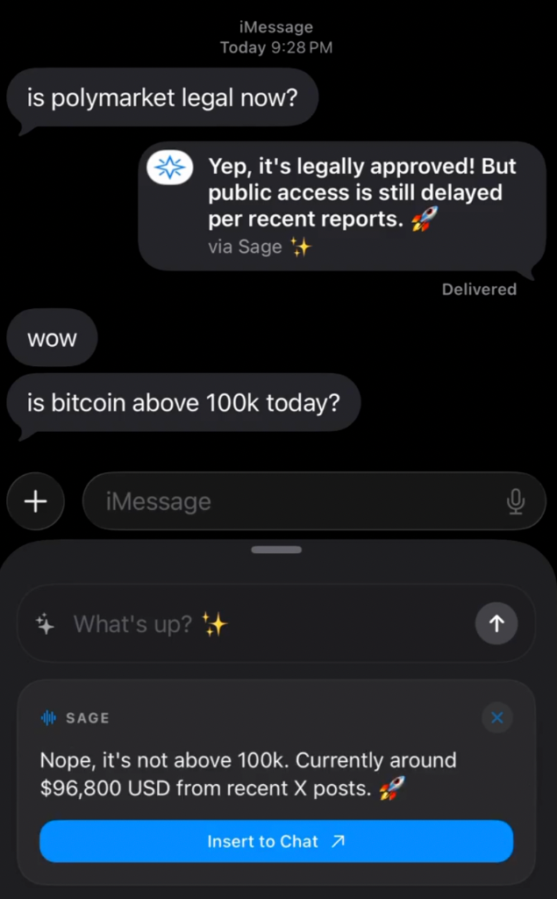

# Sage


iMessage extension for AI chat. Uses xAI's Grok with live search.

<p align="center">
  
</p>

## Requirements

- Xcode 15+
- iOS 17+ device
- xAI API key ([console.x.ai](https://console.x.ai))

## Setup

```bash
git clone https://github.com/zidank6/sage.git
cd sage/Sage
open Sage.xcodeproj
```

Add your API key to `MessagesExtension/Resources/Config.plist`:

```xml
<key>xAIAPIKey</key>
<string>your-key-here</string>
```

Update bundle identifiers to match your provisioning profile, then build to device.

## Usage

1. Open Messages
2. Tap the Apps button (+)
3. Select Sage
4. Type a question

Responses stream in real-time. Tap to send as a message bubble.

## Project Structure

```
MessagesExtension/
├── Services/
│   ├── xAIService.swift      # API client, streaming
│   └── ConfigService.swift   # Config loader
├── Views/
│   ├── CompactView.swift     # Main UI
│   └── ExpandedView.swift    # Full conversation
├── Models/
│   ├── ChatModels.swift      # Request/response types
│   └── Message.swift         # Chat state
└── Resources/
    └── Config.plist          # API key, model config
```

## Configuration

| Key | Default | Notes |
|-----|---------|-------|
| `xAIAPIKey` | — | Required |
| `DefaultModel` | `grok-3-mini` | `grok-3` for premium |
| `MaxTokens` | `300` | Response length |
| `Temperature` | `0.7` | 0-1 |

## Limitations

- Requires xAI API access (not free)
- Live search is billed separately ($0.025/source)
- iMessage extensions have limited background execution
- No on-device inference; all requests go to xAI servers

## License

MIT
